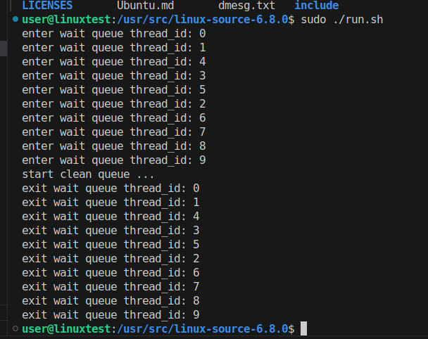

# LinuxOS Project2 
> [題目要求](./Project_2.pdf)
> 滿足 test.c(user space) 的要求，且使用 FIFO 方式輸出
> [FIFO of waitqueue的 code](./kernel.c)
> [random of waitqueue 的 code](./kernel-random.c)
## 執行結果
 
[random 結果](./random.png)
## syscall 說明
* 使用 `DECLARE_WAIT_QUEUE_HEAD(wq_head);` linux 提供的方法來建立 wait queue head struct
* 使用 `DEFINE_SPINLOCK(lock)` linux 提供的方法來建立 lock 
* 執行 `prepare_to_wait_exclusive` 去設定 wait_entry 的狀態，由於裡面已經帶有 lock，因此不需要在外面做 lock 的機制。
  * 使用 `TASK_INTERRUPTIBLE` + exclusive flag，使 wait_queue 每次都只 wake up 一個
* 進入 `schedule` 進行排班

### 所有 thread 加入完畢後，call `clean_wait_queue`
* 使用 `waitqueue_active` 檢查 wait queue 是否為空
* 如果不為空就 call `wake_up_interruptible_nr` 每次去呼叫一個 wait_queue 去啟動。
* `msleep` 去做等待，避免 print 順序亂掉

## linux process 啟動，執行後續的 enter_wait_queue
* 先用 spin lock 避免影響到 current_state 被 race condition，其中為了避免 linux2.6 `sleep on` function 發生的問題，因此讓 `remive_wait_queue` 也放在裡面一起做
  * probably issue： 設成 `TASK_RUNNING` 的時候，避免 `remove_wait_queue` 被其他 process 使用或被修改。

## 一些小觀念
* linux 6.8.0 有一個叫做 `TASK_NORMAL` 的 flag，其使用 `TASK_INTERRUPTIBLE` 與 `TASK_UNINTERRUPTIBLE` 組成，因此它可以去呼叫 wait_queue 中的 wait_queue_entry 的 `TASK_INTERRUPTIBLE` 與 `TASK_UNINTERRUPTIBLE`。其主要用因是幫助 `wake_up` function 可以都去嘗試把他們叫起來。
* `<function name>` 通常會去 call `__<function name>` 來做 lock 或是一些前處理 or 參數確認。

## 參考連結
* [Linux wait queue - Combination of exclusive and non-exclusive by stackoverflow ](https://stackoverflow.com/questions/39893500/linux-wait-queue-combination-of-exclusive-and-non-exclusive)
* [内核基础设施——wait queue](https://linux.laoqinren.net/kernel/wait-queue/)
* [Compiling kernel gives error No rule to make target 'debian/certs/debian-uefi-certs.pem' by stackoverflow](https://stackoverflow.com/questions/67670169/compiling-kernel-gives-error-no-rule-to-make-target-debian-certs-debian-uefi-ce)
* [bad shim signature- you need to load the kernel first by bad shim signature](https://forums.linuxmint.com/viewtopic.php?t=393337)
* [Linux内核同步机制之（四）：spin lock](http://www.wowotech.net/kernel_synchronization/spinlock.html)
* [Linux waitqueue 原始碼解讀](https://davidleitw.github.io/posts/linux_wake_queue1/)
